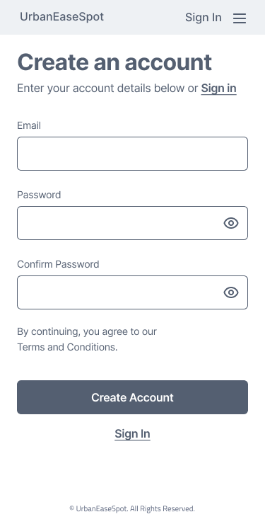

# Project Title

UrbanEaseSpot - Find Your Perfect Parking Spot

## Overview

UrbanEaseSpot is a mobile web application designed to assist users in quickly and conveniently finding parking spots in urban areas. With real-time availability information and customizable search filters, UrbanEaseSpot aims to alleviate the stress and uncertainty associated with parking in busy city centers.

### Problem

Many urban residents and visitors face the challenge of finding convenient and affordable parking spots, leading to wasted time, frustration, and sometimes parking violations. The UrbanEaseSpot app addresses this pain point by providing users with accurate information about available parking spots nearby, allowing them to make informed decisions and streamline the parking process.

### User Persona

UrbanEaseSpot Users:

- Need a convenient solution for finding parking spots quickly and efficiently when commuting to work or attending meetings in busy urban areas. 
- Need real-time availability information and customizable search filters to easily locate parking spots near a specific destination. 
- Value notifications about parking session statuses and expiry.
- Value the ability to extend their parking sessions when needed.

### Features

- As a user, I want to be able to find parking spots near my destination.
- As a user, I want to be able to filter parking spots based on availability, type of payment accepted, accessible parking, and motorbike parking.
- As a user, I want to be able to create an account to manage my parking information.

- As a logged in user, I want to be able to select the duration of the booking.
- As a logged in user, I want to be able to book a parking spot.
- As a logged in user, I want to receive notification about my parking session's status and expiry.
- As a logged in user, I want to be able to extend my parking sessions

## Implementation

### Tech Stack

- React
- MySQL
- Express
- Client libraries: 
    - react
    - react-router
    - axios
    - sass
    - leaflet
    - react-leaflet
    - react-leaflet-cluster
- Server libraries:
    - knex
    - express
    - dotenv

### API Reference

#### External APIs

##### 1. Parking meters in Vancouver

Link to  API: 
https://opendata.vancouver.ca//api/explore/v2.1/catalog/datasets/parking-meters/records

- Limit 20 records
/api/explore/v2.1/catalog/datasets/parking-meters/records?limit=20

- All parking meters excluding disability and motorbike parking slots

/api/explore/v2.1/catalog/datasets/parking-meters/records?limit=20&exclude=meterhead%3A%22Single%20Motorbike%22%2C%22Single%20Disability%22

- Accept credit card for payment
/api/explore/v2.1/catalog/datasets/parking-meters/records?limit=20&refine=creditcard%3AYes

- Accessible parking
/api/explore/v2.1/catalog/datasets/parking-meters/records?refine=meterhead%3A%22Single%20%2F%20Disability%22

- Single Motorbike
/api/explore/v2.1/catalog/datasets/parking-meters/records?limit=20&refine=meterhead%3A%22Single%20Motorbike%22

##### 2. Geocoding API

- Forward Geocode: (convert address to coordinates):

https://geocode.maps.co/search?q=address&api_key=api_key

Example: Pass the address string using the q parameter to the /search endpoint
https://geocode.maps.co/search?q=Statue+of+Liberty+NY+US&api_key=api_key

Or

Search by name, e.g. for the Statue of Liberty:

https://geocode.maps.co/search?q=Statue+of+Liberty+NY+US&api_key=api_key

- Reverse Geocode: 
https://geocode.maps.co/reverse?lat=latitude&lon=longitude&api_key=api_key

provide both the lat and lon parameters to the /reverse endpoint, e.g:

https://geocode.maps.co/reverse?lat=40.7558017&lon=-73.9787414&api_key=api_key

Default JSON data returned by API endpoints will be utitilized for the project for search functionality

### Sitemap

#### For sprint - 1
-----
- Home/Search Page (Map View of parking spots)
- Filter page
- Parking Duration Page
- Confirm Parking Page
- Notifications Page (without extend functioanality)
- Login Page (Dummy user data will be used for sprint-1)

#### For next sprint
-----
- Create Account Page
- List View of available parking spots
- User Profile
    - Add Vehicle
    - Add Payment 
- Notifications Page with extend functioanality

### Mockups

#### Home/Search Page (Zoom-out)

#### Home/Search Page (Zoom-in)

#### Filter Page

#### Filter Results Page

#### Parking Duration Page

#### Confirm Parking Page

#### Notification Extend Page

#### Notification Extend Success Page

#### Notification Extend Fail Page

#### Login Page

#### Create Account Page

### Data 

### Endpoints

#### Get all the parking spots

#### Get user information for given user id

#### Get status of the parking spots for a given meter id

### Update status of the parking spot for a given meter id

#### Post booking of the parking spot for a given user id, meter id

## Roadmap

- Front-End Setup: Initial Folder Structure & Git Repo

- Back-End Setup: Initial Folder Structure & Git Repo

- Front-End: Setup styling and assets (sass, mixins, global variables, typography, icons)

- Back-End: Setup routes

- Back-End: Database connection with Knex

- Back-End: Create migration files and seed files

- Front-End: Header Component

- Front-End: Footer Component

- Front-End: Home Page / Map View

- Front-End: Filter 

- Front-End: Parking Duration  

- Front-End: Confirm Parking  

- Front-End: Notification (without extension)

- Front-End Login Page (Dummy user data will be used for sprint-1)

- Back-End: API to get all the parking spots

- Back-End: API to get user information for given userid (including payment method and vehicle details)

- Back-End: API to get status of the parking spots for a given meterid

- Back-End: API to update status of the parking spot for a given meterid

- Back-End: API to post booking of the parking spot for a given userid, meterid.

- Bug fixes

- DEMO DAY

## Nice-to-haves

Features: 

- Responsive design
- Notification extend functionality
- Search
    - By location or address (Geocoding API)
    - Auto complete address
    - Distance radius functionality
- List View of the parking spots
- Login
    - Implement JWT tokens for authorization of login
    - Forgot password functionality 
- Create user profile
    - Add vehicle
    - Add payment details
    - Delete payment information

Tech-Stack:
- Typescript
- Tailwind.css

## Instructions to setup client application

### Install the following dependencies
npm install <dependencies>
- axios
- leaflet
- react-leaflet
- react-leaflet-cluster
- react-router-dom
- react-scripts
- sass

### Create .env file
- See .env.sample file

